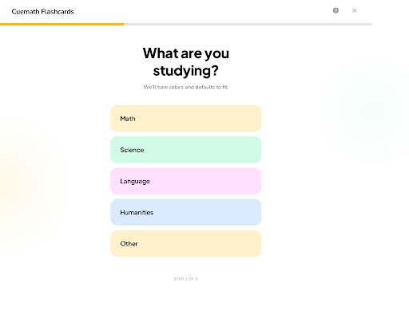
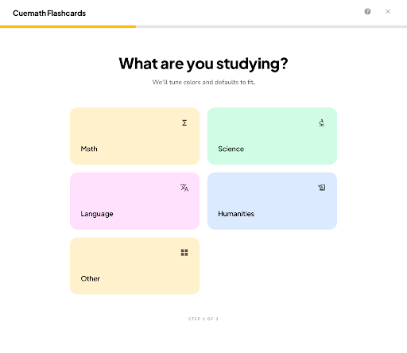
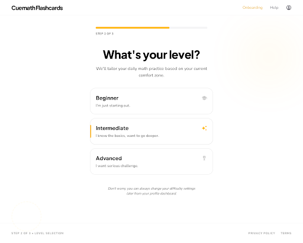
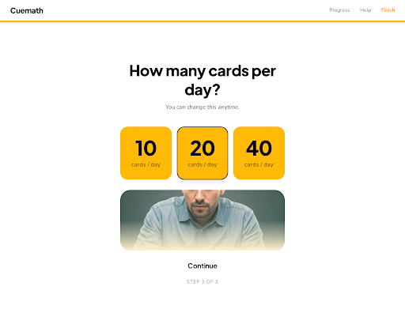
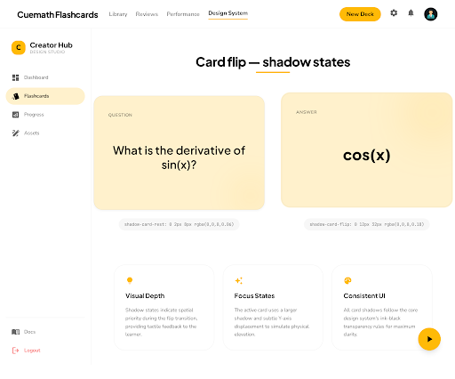

# Stitch desktop mockups — Cuemath Flashcards v1

Plan 5, Task 0 deliverable. Stitch is the visual north star; this folder is the bridge between Stitch screens and our existing React primitives in `lib/brand/primitives/`.

- **Stitch project:** `cuemath-flashcards-v1` — `projects/3065800030091529504`
- **Design system asset:** `assets/14145443449352759407` (Plus Jakarta Sans + Nunito Sans, primary `#FFBA07`, secondary `#FFF1CC`, tertiary `#D0FBE5`, ROUND_TWELVE)
- **Viewport:** all 4 screens generated with `deviceType=DESKTOP`. Screenshot widths 2560–2880px (2x DPR of 1280–1440px logical). No mobile regenerations needed.

## Brand tokens applied

cueYellow `#FFBA07` · inkBlack `#000` · paperWhite `#FFF` · softCream `#FFF1CC` · mintGreen `#D0FBE5` · bubblePink `#FFE0FD` · trustBlue `#DBEAFE` · alertCoral `#F97373`. Radii 12 / 24 / 32. Display = Plus Jakarta Sans extrabold; body = Nunito Sans.

## Existing primitives (reuse — do not rebuild)

`lib/brand/primitives/`
- `CueButton` — primary | ghost | pill, sizes default | sm | lg
- `CueCard` — paper-white default; subject-tinted via `subjectTint()`
- `CuePill` — neutral | success | warning | info | highlight
- `TrustChip` — softCream pill with optional icon

`components/`
- `mastery-ring.tsx` · `rating-bar.tsx` · `review-card.tsx`

---

## landing-hero

- Mapping: [`landing-hero.md`](./landing-hero.md)
- HTML: [`html/landing-hero.html`](./html/landing-hero.html)
- **Primitives covered:** `CuePill` (journey pill), `CueButton` primary lg (CTA), `TrustChip` ×3, `CueCard` ×3 (How it works triad).
- **Net-new:** `display-hero` clamp scale `clamp(48px, 7vw, 72px)`; small numbered-circle inline component (8px radius circle, cue-yellow fill).

## review-sprint

- Mapping: [`review-sprint.md`](./review-sprint.md)
- HTML: [`html/review-sprint.html`](./html/review-sprint.html)
- **Primitives covered:** `CueCard` (softCream tint), `CueButton` primary lg (`w-full` override).
- **Net-new:** `ProgressDots` composite (20-dot strip, three dot states); `app/(app)/review/layout.tsx` focus-mode shell `mx-auto max-w-[640px] pt-20`.

## review-card-flip-front

- Mapping: [`review-card-flip-front.md`](./review-card-flip-front.md)
- HTML: [`html/review-card-flip-front.html`](./html/review-card-flip-front.html)
- **Primitives covered:** `CueCard` (softCream, default shadow-sm).
- **Net-new:** `cue-label` convention (`text-xs uppercase tracking-[0.08em] text-ink-black/60`).

## review-card-flip-back

- Mapping: [`review-card-flip-back.md`](./review-card-flip-back.md)
- HTML: [`html/review-card-flip-back.html`](./html/review-card-flip-back.html)
- **Primitives covered:** `CueCard` (deeper shadow override), existing `components/rating-bar.tsx`.
- **Net-new:** `hardOrange #FB923C` token (verify against Cuemath brand kit before adoption); `shadow-card-back` utility `0 12px 32px rgba(0,0,0,0.08)`; optional `showHints` prop on `RatingBar` for keyboard digit labels.

---

## onboarding-subject

Variant (2-col grid, not chosen): 

- Mapping: [`onboarding-subject.md`](./onboarding-subject.md)
- HTML: [`html/onboarding-subject.html`](./html/onboarding-subject.html) · [variant](./html/onboarding-subject-variant.html)
- Stitch screens: `f8b3e0c999c54a51930eec74bbf1c1d1` (primary), `16794c2cd9a442248a993516e6df44c8` (variant)
- **Primitives covered:** `CueCard subject={...}` ×5 (Math/Science/Language/Humanities/Other tints).
- **Net-new:** `OnboardingProgress` composite (not a primitive — colocated under `app/(app)/onboarding/_components/`); extend `subjectFamily` token union with `'other'`.

## onboarding-level

- Mapping: [`onboarding-level.md`](./onboarding-level.md)
- HTML: [`html/onboarding-level.html`](./html/onboarding-level.html)
- Stitch screen: `29d75761ff6b447bb55e5b881e90f022`
- **Primitives covered:** `CueCard` paper-white default ×3, `OnboardingProgress` (from subject step).
- **Net-new:** None at primitive level. Active-state left accent bar via Tailwind `before:` pseudo-element on `CueCard`.

## onboarding-goal

- Mapping: [`onboarding-goal.md`](./onboarding-goal.md)
- HTML: [`html/onboarding-goal.html`](./html/onboarding-goal.html)
- Stitch screen: `058dbfdfa13d437c82a0e51b4c06814b`
- **Primitives covered:** `CueCard` (proposed `tone="highlight"`) ×3, `CueButton variant="ghost"` (Continue), `OnboardingProgress`.
- **Net-new:** Optional `tone?: 'highlight'` prop on `CueCard` → `bg-cue-yellow`. Mirrors `CuePill`'s `tone` API.

## card-flip-shadow-states

- Mapping: [`card-flip-shadow-states.md`](./card-flip-shadow-states.md)
- HTML: [`html/card-flip-shadow-states.html`](./html/card-flip-shadow-states.html)
- Stitch screen: `d2e0b816e9194601b5949c59c6fcdb34`
- **Primitives covered:** `CueCard subject="math"` (both states), `cue-label` utility (existing).
- **Net-new (the deliverable):** 2 shadow tokens in `app/globals.css` — `--shadow-card-rest: 0 2px 8px rgba(0,0,0,0.06)` and `--shadow-card-flip: 0 12px 32px rgba(0,0,0,0.18)`. **Supersedes** earlier `shadow-card-front` / `shadow-card-back` proposals (renamed + opacity bumped from 0.04/0.08 → 0.06/0.18 to read against soft-cream tint).

---

## Cross-cutting net-new CSS summary

| Token / utility | Value | Rationale |
|---|---|---|
| `display-hero` font-size | `clamp(48px, 7vw, 72px)`, `tracking: -0.02em`, `leading: 0.95` | Landing hero headline scale |
| `cue-label` | `text-xs uppercase tracking-[0.08em] text-ink-black/60 font-body` | Card section labels (QUESTION/ANSWER) |
| `--shadow-card-rest` | `0 2px 8px rgba(0,0,0,0.06)` | Resting flashcard depth (supersedes `shadow-card-front`) |
| `--shadow-card-flip` | `0 12px 32px rgba(0,0,0,0.18)` | Mid-flip flashcard depth (supersedes `shadow-card-back`) |
| `hardOrange` | `#FB923C` (TBD vs brand kit) | Rating bar "Hard" button |
| `CueCard` `tone?: 'highlight'` | `bg-cue-yellow` | Goal step "10 / 20 / 40" pill-cards |
| `subjectFamily` += `'other'` | maps to `softCream` | Subject step "Other" row |

## For downstream tasks

- **Task 2 (landing surface):** consume `CueCard` + `CueButton` + `CuePill` + `TrustChip` directly; only net-new is the headline clamp + numbered circle.
- **Task 3 (onboarding wiring):** rebuild `app/(app)/onboarding/{subject,level,goal}/page.tsx` against the 3 mockups. Add `OnboardingProgress` composite, extend `subjectFamily` with `'other'`, add `CueCard` `tone?: 'highlight'` prop. No new primitives.
- **Task 4 (review polish):** wire `cue-label` + the **two new shadow tokens** (`--shadow-card-rest`, `--shadow-card-flip`) into `components/review-card.tsx`; drop `CueCard`'s default `shadow-sm` and re-add at the ~3 affected call sites. Confirm `hardOrange` against brand kit before merging.
- **Task 5 (deploy):** no UI work blocked here.

---

# Pass 2 mockups (post-deploy redesign)

## library-grid

See `library-grid.md` (and `library-grid-variant.md`). Stitch screens `e5281a754c0a44b78840c8bdf114c96c` (primary) + `ec51a8244ebf40daaab9edb56f1f9701` (variant). Desktop 1280px logical.

## deck-detail

See `deck-detail.md`. Stitch screen `075e922ad07242d4b5027509e9ccdcea`.

## login-magic

See `login-magic.md`. Stitch screen `f1d41cf0bb774e75a0f15ddd05746fd2`.

## sprint-complete

See `sprint-complete.md`. Stitch screen `8be6267e87a346bd9d078824b3f0fa6b`.

## upload-modal

See `upload-modal.md`. Stitch screen `728deac81c2345ec9f879f6d1280dd84`.
