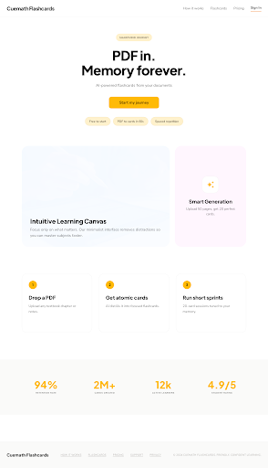
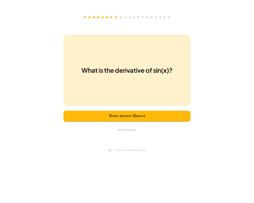
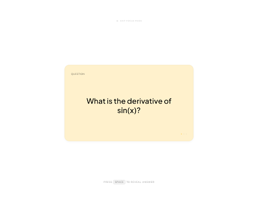
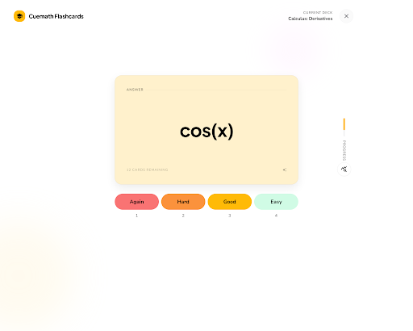

# Stitch desktop mockups — Cuemath Flashcards v1

Plan 5, Task 0 deliverable. Stitch is the visual north star; this folder is the bridge between Stitch screens and our existing React primitives in `lib/brand/primitives/`.

- **Stitch project:** `cuemath-flashcards-v1` — `projects/3065800030091529504`
- **Design system asset:** `assets/14145443449352759407` (Plus Jakarta Sans + Nunito Sans, primary `#FFBA07`, secondary `#FFF1CC`, tertiary `#D0FBE5`, ROUND_TWELVE)
- **Viewport:** all 4 screens generated with `deviceType=DESKTOP`. Screenshot widths 2560–2880px (2x DPR of 1280–1440px logical). No mobile regenerations needed.

## Brand tokens applied

cueYellow `#FFBA07` · inkBlack `#000` · paperWhite `#FFF` · softCream `#FFF1CC` · mintGreen `#D0FBE5` · bubblePink `#FFE0FD` · trustBlue `#DBEAFE` · alertCoral `#F97373`. Radii 12 / 24 / 32. Display = Plus Jakarta Sans extrabold; body = Nunito Sans.

## Existing primitives (reuse — do not rebuild)

`lib/brand/primitives/`
- `CueButton` — primary | ghost | pill, sizes default | sm | lg
- `CueCard` — paper-white default; subject-tinted via `subjectTint()`
- `CuePill` — neutral | success | warning | info | highlight
- `TrustChip` — softCream pill with optional icon

`components/`
- `mastery-ring.tsx` · `rating-bar.tsx` · `review-card.tsx`

---

## landing-hero

- Mapping: [`landing-hero.md`](./landing-hero.md)
- HTML: [`html/landing-hero.html`](./html/landing-hero.html)
- **Primitives covered:** `CuePill` (journey pill), `CueButton` primary lg (CTA), `TrustChip` ×3, `CueCard` ×3 (How it works triad).
- **Net-new:** `display-hero` clamp scale `clamp(48px, 7vw, 72px)`; small numbered-circle inline component (8px radius circle, cue-yellow fill).

## review-sprint

- Mapping: [`review-sprint.md`](./review-sprint.md)
- HTML: [`html/review-sprint.html`](./html/review-sprint.html)
- **Primitives covered:** `CueCard` (softCream tint), `CueButton` primary lg (`w-full` override).
- **Net-new:** `ProgressDots` composite (20-dot strip, three dot states); `app/(app)/review/layout.tsx` focus-mode shell `mx-auto max-w-[640px] pt-20`.

## review-card-flip-front

- Mapping: [`review-card-flip-front.md`](./review-card-flip-front.md)
- HTML: [`html/review-card-flip-front.html`](./html/review-card-flip-front.html)
- **Primitives covered:** `CueCard` (softCream, default shadow-sm).
- **Net-new:** `cue-label` convention (`text-xs uppercase tracking-[0.08em] text-ink-black/60`).

## review-card-flip-back

- Mapping: [`review-card-flip-back.md`](./review-card-flip-back.md)
- HTML: [`html/review-card-flip-back.html`](./html/review-card-flip-back.html)
- **Primitives covered:** `CueCard` (deeper shadow override), existing `components/rating-bar.tsx`.
- **Net-new:** `hardOrange #FB923C` token (verify against Cuemath brand kit before adoption); `shadow-card-back` utility `0 12px 32px rgba(0,0,0,0.08)`; optional `showHints` prop on `RatingBar` for keyboard digit labels.

---

## Cross-cutting net-new CSS summary

| Token / utility | Value | Rationale |
|---|---|---|
| `display-hero` font-size | `clamp(48px, 7vw, 72px)`, `tracking: -0.02em`, `leading: 0.95` | Landing hero headline scale |
| `cue-label` | `text-xs uppercase tracking-[0.08em] text-ink-black/60 font-body` | Card section labels (QUESTION/ANSWER) |
| `shadow-card-front` | `0 4px 12px rgba(0,0,0,0.04)` | Resting card depth |
| `shadow-card-back` | `0 12px 32px rgba(0,0,0,0.08)` | Mid-flip / revealed card depth |
| `hardOrange` | `#FB923C` (TBD vs brand kit) | Rating bar "Hard" button |

## For downstream tasks

- **Task 2 (landing surface):** consume `CueCard` + `CueButton` + `CuePill` + `TrustChip` directly; only net-new is the headline clamp + numbered circle.
- **Task 4 (review polish):** wire `cue-label` + dual card shadows + `showHints` on `RatingBar`. Confirm `hardOrange` against brand kit before merging.
- **Task 5 (deploy):** no UI work blocked here.
