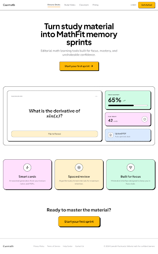
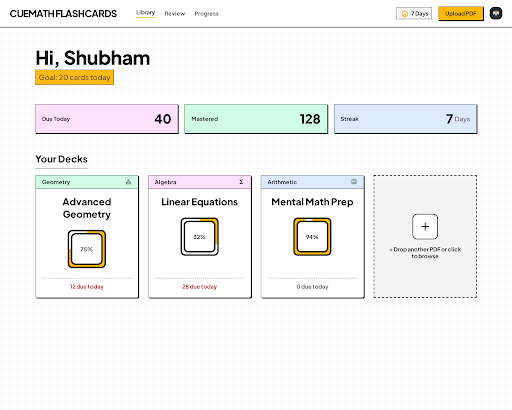
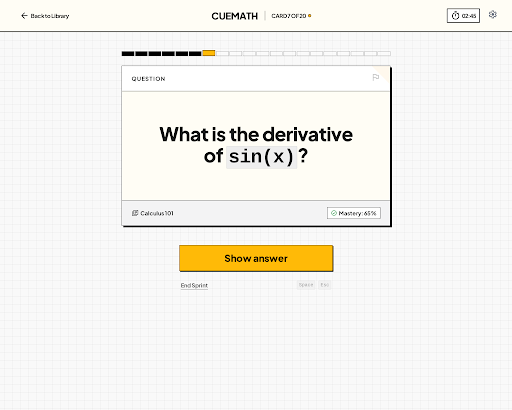

# Cuemath Grid Minimal Inspirations

Generated with Stitch in project `projects/3065800030091529504` on 2026-04-30.

Intent: push the current product away from generic soft SaaS minimalism and toward Cuemath's branded minimalism: graph-paper grid, hard black lines, loud yellow CTAs, pastel block panels, and structured flashcard/deck/review UI. These explorations intentionally avoid replacing the product with worksheets, formula sheets, or textbook artifacts.

## Generated Screens

| Screen | Stitch ID | Local Screenshot | Local HTML |
|---|---|---|---|
| Landing | `dea1f974d0934ac5894d18397ffcbde2` | `screenshots/cuemath-grid-landing-inspiration.png` | `html/cuemath-grid-landing-inspiration.html` |
| Library | `8898f9c6ef5645feb708524969d10202` | `screenshots/cuemath-grid-library-inspiration.png` | `html/cuemath-grid-library-inspiration.html` |
| Review | `bd2e926315b54b01927a653913150214` | `screenshots/cuemath-grid-review-inspiration.png` | `html/cuemath-grid-review-inspiration.html` |

## Landing

What to keep:
- The product collage as a bordered rectangular system, not a soft preview card.
- The yellow CTA with a black border and compact arrow.
- Pastel proof blocks with simple sticker-like icons.

What to refine:
- The header is too tiny and the wordmark casing is off.
- The first viewport can be more confident and less centered-generic.
- The proof cards are clean, but they need more Cuemath-scale typography.

## Library

What to keep:
- This is the clearest direction for the app shell: grid background, black dividers, compact nav, yellow upload CTA.
- The stat strip works well as colored rectangular blocks.
- Deck cards feel product-native while getting much closer to Cuemath's block language.
- The dashed add-card is a good anti-bland empty/upload affordance.

What to refine:
- The deck cards need slightly better density and hierarchy.
- We should keep our existing mastery ring behavior, but render it in this harder bordered container language.
- The header should use `CUEMATH` and a smaller `FLASHCARDS` companion label rather than a fused wordmark.

## Review

What to keep:
- The centered review card is focused and branded without becoming noisy.
- The rectangular progress cells are much more Cuemath than a smooth progress bar.
- The black top border/header line on the card gives the flashcard a physical worksheet-tool feel without making it a worksheet.
- The CTA is finally loud enough.

What to refine:
- The card can be wider/taller for real question content.
- The progress strip should align more deliberately with the card width.
- The keyboard hints are too faint; make them legible while keeping them secondary.

## Implementation Direction

Start with Library and Review before revisiting Landing. The library proves the brand system can work in a real app dashboard, and the review screen proves it can stay focused during study. The strongest reusable rules are:

- Add a subtle graph-paper background utility.
- Reduce large product surface radii toward 4-8px.
- Use black 1px borders as the main structure.
- Turn stats, deck summaries, and review progress into rectangular block systems.
- Make the primary action a yellow bordered rectangle.
- Keep pastel fills as functional subject/status surfaces, not decoration.
